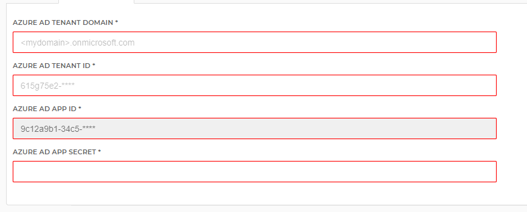

# HelloID-Conn-Prov-Target-Office365-Licenses

| :information_source: Information |
|:---------------------------|
| This repository contains the connector and configuration code only. The implementer is responsible to acquire the connection details such as username, password, certificate, etc. You might even need to sign a contract or agreement with the supplier before implementing this connector. Please contact the client's application manager to coordinate the connector requirements.       |

 

  

## Table of contents

- [Introduction](#Introduction)
- [Getting started](#Getting-started)
  + [Connection settings](#Connection-settings)
  + [Prerequisites](#Prerequisites)
  + [Contents](#Contents)
  + [Supported PowerShell versions](#Supported-PowerShell-versions)
  + [Getting access to the Graph API](#Getting-access-to-the-Graph-API)
- [Setup the connector](#Setup-the-connector)
- [Getting help](#Getting-help)
- [Contributing](#Contributing)
- [HelloID Docs](#HelloID-Docs)

## Introduction

- Correlates (looks up) the person with the office365 user.
- Retreives the available subscribed licences, and generate associated HelloID entitlements.
- Grants and revokes these entitlements, which summounds to office356 licences (sku's) and associated serverplans to individual user accounts in office365 ("Microsoft Azure AD").

Note, it will NOT:
- Create the user accounts in office365. These are typically created by the "Microsoft Azure AD" target connector in HelloID.
- Create the Subscriptions in Office365 that generate the pool of licenses available. These are to be managed manually in the Azure environment.

## Getting started

### Connection settings

| Setting     | Description |
| ------------ | ----------- |
| AADTenantDomain          | The windows domain name of your Azure environment, e.g  "myazuredomain.onmicrosoft.com"                   |
| AADTenantID      | The Azure Tenant ID of your Azure environment                  |
| AADAppID               |     The App ID of the "App registration" in your Azure AD enviroment. The "App registration" in Azure is the identity with which this HelloID connector will log in your Azure environment to perform all actions |
| AADAppSecret               |     The "Client secret" generated by the "App registration" in your Azure AD enviroment, that serves as a sort of password.
|             |                                            |

### Prerequisites

- Microsoft AzureAD

- An App registration in Azure to be used by HelloID with sufficient rights for the "Microsoft Graph" api (permissions for User.ReadWrite.All, and Organzation.read.all of the "application" type).

- A HelloID person model with enough info to correlate the person to an existing Azure user. The current implementation uses the UPN and expects this to be available in $p.Accounts.MicrosoftAzureAD.UserPrincipalName. This is the case when "Microsoft Azure AD" target connector in HelloID is used to provision the account itself.

### Contents

| Files       | Description                                |
| ----------- | ------------------------------------------ |
| configuration.json | The configuration settings for HelloID
| create.ps1  | This script is used to look up an existing Azure AD account from information in the person model. The AzureAD account wil be stored, as is standard, in the $accountReference variable for this connector in HelloID. This info is used by the grand and revoke scripts to be able to indentify the account |
| Entitlements.ps1  | Collects all the available sku's (licences) by getting the "subscribedSkus". It will loop though all available sku's. For those sku's that are of interest, on of more entitlements are generated. An entitlement is build from an sku, optionally in combination with a fixed set of service plans that should be disabled for that specific entitlement |
| grant.ps1  | Grants a specific entitlement (sku with optionallay disabled services) to a user |
| revoke.ps1  | Revokes a specific entitlement (sku with optionallay disabled services) to a user |
|             |                                            |

### Supported PowerShell versions

The connector is created for both Windows PowerShell 5.1 and PowerShell Core 7.0.3. This means that the connector can be executed in both cloud and on-premises using the HelloID Agent.

> Older versions of Windows PowerShell are not supported.

### Getting access to the Graph API

#### Application Registration
The first step to connect to Graph API and make requests, is to register a new <b>Azure Active Directory Application</b>. The application is used to connect to the API and to manage permissions.

* Navigate to <b>App Registrations</b> in Azure, and select “New Registration” (<b>Azure Portal > Azure Active Directory > App Registration > New Application Registration</b>).
* Next, give the application a name. In this example we are using “<b>HelloID PowerShell</b>” as application name.
* Specify who can use this application (<b>Accounts in this organizational directory only</b>).
* Specify the Redirect URI. You can enter any url as a redirect URI value. In this example we used http://localhost because it doesn't have to resolve.
* Click the “<b>Register</b>” button to finally create your new application.

Some key items regarding the application are the Application ID (which is the Client ID), the Directory ID (which is the Tenant ID) and Client Secret.

#### Configuring App Permissions
The [Microsoft Graph documentation](https://docs.microsoft.com/en-us/graph) provides details on which permission are required for each permission type.

To assign your application the right permissions, navigate to <b>Azure Portal > Azure Active Directory >App Registrations</b>.
Select the application we created before, and select “<b>API Permissions</b>” or “<b>View API Permissions</b>”.
To assign a new permission to your application, click the “<b>Add a permission</b>” button.
From the “<b>Request API Permissions</b>” screen click “<b>Microsoft Graph</b>”.
For this connector the following permissions are used as <b>Application permissions</b>:
*	Read and Write all user’s full profiles by using <b><i>User.ReadWrite.All</i></b>
*	Read the available subscribed licenses by using <b><i>Organisation.Read.All</i></b>

Some high-privilege permissions can be set to admin-restricted and require an administrators consent to be granted.

To grant admin consent to our application press the “<b>Grant admin consent for TENANT</b>” button.

#### Authentication and Authorization
There are multiple ways to authenticate to the Graph API with each has its own pros and cons, in this example we are using the Authorization Code grant type.

*	First we need to get the <b>Client ID</b>, go to the <b>Azure Portal > Azure Active Directory > App Registrations</b>.
*	Select your application and copy the Application (client) ID value.
*	After we have the Client ID we also have to create a <b>Client Secret</b>.
*	From the Azure Portal, go to <b>Azure Active Directory > App Registrations</b>.
*	Select the application we have created before, and select "<b>Certificates and Secrets</b>".
*	Under “Client Secrets” click on the “<b>New Client Secret</b>” button to create a new secret.
*	Provide a logical name for your secret in the Description field, and select the expiration date for your secret.
*	It's IMPORTANT to copy the newly generated client secret, because you cannot see the value anymore after you close the page.
*	At last we need to get is the <b>Tenant ID</b>. This can be found in the Azure Portal by going to <b>Azure Active Directory > Custom Domain Names</b>, and then finding the .onmicrosoft.com domain.

## Setup the connector

1. Make sure that an App is registered within AzureAD.

2. Add a new 'Target System' to HelloID.

3. On the _Account_ tab, click __Custom connector configuration__ and import the code from the _configuration.json_ file.

4. Under __Account Create__ click __Configure__ and import the code from the _create.ps1_ file.

5. Go to the _Configuration_ tab and fill in the required fields.

## Getting help

> _For more information on how to configure a HelloID PowerShell connector, please refer to our [documentation](https://docs.helloid.com/hc/en-us/articles/360012557600-Configure-a-custom-PowerShell-source-system) pages_

## Contributing

Find a bug or have an idea! Open an issue or submit a pull request!

## HelloID Docs

The official HelloID documentation can be found at: https://docs.helloid.com/
